# Backend Architecture Diagram - Smart Rental System

## NestJS MVC Architecture Flow

```mermaid
graph TB
    Client[👤 Client/Frontend]

    subgraph "NestJS Backend"
        Guards[🛡️ Guards Layer<br/>JWT Auth + Roles]
        Controller[🎮 Controller Layer<br/>@Controller, @Get, @Post]
        Service[⚙️ Service Layer<br/>Business Logic]
        Prisma[🔌 Prisma Service<br/>ORM Layer]
    end

    DB[(🗄️ PostgreSQL<br/>Database)]

    Client -->|1. HTTP Request| Guards
    Guards -->|2. Validate JWT| Controller
    Controller -->|3. Call Method| Service
    Service -->|4. Query/Mutation| Prisma
    Prisma -->|5. SQL Query| DB
    DB -->|6. Data| Prisma
    Prisma -->|7. Entity Objects| Service
    Service -->|8. DTO Response| Controller
    Controller -->|9. HTTP Response| Client

    style Client fill:#e1f5ff
    style Guards fill:#fff4e1
    style Controller fill:#ffe1e1
    style Service fill:#e1ffe1
    style Prisma fill:#f0e1ff
    style DB fill:#e1e1e1
```

## Detailed Flow by Module

### Example: Invoice Module

## Layer Responsibilities

### 🛡️ Guards Layer
- **JwtAuthGuard**: Validate access token
- **RolesGuard**: Check user permissions
- **RefreshTokenGuard**: Validate refresh token

### 🎮 Controller Layer
**Responsibilities:**
- Route definition (@Get, @Post, @Patch, @Delete)
- Request validation (DTOs)
- HTTP response formatting
- Swagger documentation (@ApiOperation, @ApiResponse)

**Example Modules:**
- `auth.controller.ts`
- `invoices.controller.ts`
- `contracts.controller.ts`
- `rooms.controller.ts`

### ⚙️ Service Layer
**Responsibilities:**
- Business logic implementation
- Data validation
- Transaction management
- Complex calculations (invoice, pro-rata, settlement)
- Error handling

**Example Modules:**
- `invoices.service.ts` - Complex billing engine
- `contracts.service.ts` - Contract lifecycle + room moves
- `readings.service.ts` - Meter reading management

### 🔌 Prisma Layer
**Responsibilities:**
- Database abstraction
- Type-safe queries
- Relationship management
- Migration handling

**Schema Models:**
- User, Building, Room, Tenant
- Contract, Service, ServiceReading
- Invoice, Transaction, Issue

### 🗄️ Database Layer
**PostgreSQL Database:**
- 11 tables
- Relationships with foreign keys
- Indexes for performance
- Constraints for data integrity

## Request/Response Flow Example

### Create Contract Flow

## Module Dependencies

## Technology Stack

## Authentication Flow

## Database Schema Relationships

---

## How to View These Diagrams

### On GitHub
- Push this file to GitHub
- GitHub automatically renders Mermaid diagrams
- View directly in browser

### In VS Code
- Install extension: "Markdown Preview Mermaid Support"
- Open this file
- Press `Ctrl+Shift+V` (Windows) or `Cmd+Shift+V` (Mac)

### Online Tools
1. **Mermaid Live Editor**: https://mermaid.live/
   - Copy any diagram code
   - Paste and view
   - Export as PNG/SVG

2. **Draw.io**: https://app.diagrams.net/
   - Import the draw.io XML file (created separately)

3. **Excalidraw**: https://excalidraw.com/
   - For hand-drawn style diagrams
