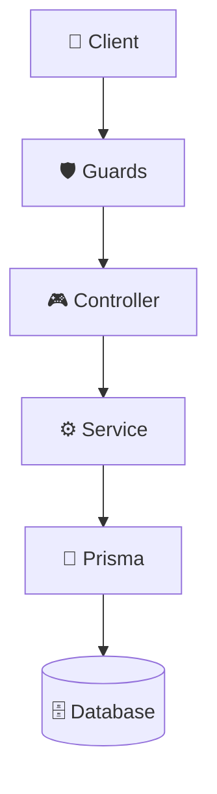
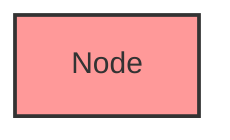

# 📊 Hướng Dẫn Sử Dụng Architecture Diagrams

Tôi đã tạo cho bạn **3 loại diagram** với **5+ diagrams** khác nhau để visualize backend architecture.

---

## 📁 Files Đã Tạo

1. **ARCHITECTURE_DIAGRAM.md** - File Mermaid diagrams (7 diagrams)
2. **architecture.drawio** - File Draw.io (editable)
3. **FUNCTION_LIST.csv** - Import vào Google Sheets

---

## 🎨 Cách 1: Xem Mermaid Diagrams (Khuyên Dùng - NHANH NHẤT)

### Trên GitHub (Tự Động Render)
1. Push files lên GitHub (đã xong ✅)
2. Mở file `ARCHITECTURE_DIAGRAM.md` trên GitHub
3. GitHub tự động render tất cả diagrams
4. **Link:** `https://github.com/betallsoph/smart-rental-capstone-baovietz98/blob/claude/review-backend-codebase-gpWkm/backend/ARCHITECTURE_DIAGRAM.md`

### Trong VS Code
1. Cài extension: **Markdown Preview Mermaid Support**
2. Mở file `ARCHITECTURE_DIAGRAM.md`
3. Nhấn `Ctrl+Shift+V` (Windows) hoặc `Cmd+Shift+V` (Mac)
4. Xem diagrams ngay trong VS Code

### Mermaid Live Editor (Online)
1. Truy cập: https://mermaid.live/
2. Copy code từ file `ARCHITECTURE_DIAGRAM.md`
3. Paste vào editor
4. Export PNG/SVG/PDF

**Ví dụ code để copy:**


---

## 🖼️ Cách 2: Edit Trên Draw.io (CHỈ SỬA)

### Online (Không Cần Cài Đặt)
1. Truy cập: **https://app.diagrams.net/**
2. Click **Open Existing Diagram**
3. Chọn file `architecture.drawio`
4. Chỉnh sửa thoải mái:
   - Kéo thả boxes
   - Đổi màu
   - Thêm/xóa elements
   - Thêm text
5. Export:
   - **File → Export as → PNG** (cho docs)
   - **File → Export as → SVG** (cho web)
   - **File → Export as → PDF** (cho in)

### Desktop App (Tốt Hơn)
1. Download: https://github.com/jgraph/drawio-desktop/releases
2. Cài đặt Draw.io Desktop
3. Mở file `architecture.drawio`
4. Chỉnh sửa và save

---

## 🚀 Cách 3: Import Vào Các Tools Khác

### Lucidchart (Professional)
1. Truy cập: https://www.lucidchart.com/
2. Import file `architecture.drawio`
3. Hoặc tạo mới từ Mermaid code

### Excalidraw (Hand-Drawn Style)
1. Truy cập: https://excalidraw.com/
2. Vẽ lại theo mẫu (style vẽ tay đẹp)
3. Export PNG với style hand-drawn

### Miro (Collaboration)
1. Truy cập: https://miro.com/
2. Import image từ Draw.io export
3. Team có thể collaborate real-time

---

## 📋 7 Diagrams Đã Tạo

### 1. **Main Architecture Flow**
```
Client → Guards → Controller → Service → Prisma → Database
```
Hiển thị luồng request/response cơ bản

### 2. **Sequence Diagram - Invoice Generation**
```
Client → Controller → Service → Prisma → Database
```
Chi tiết từng bước tạo invoice

### 3. **Layer Responsibilities**
Text-based explanation của từng layer

### 4. **Create Contract Flow**
Decision tree cho contract creation

### 5. **Module Dependencies**
Graph hiển thị quan hệ giữa 12 modules

### 6. **Technology Stack**
Visual stack diagram

### 7. **Database Schema (ERD)**
Entity Relationship Diagram với 11 tables

---

## 💡 Tips Sử Dụng

### Cho Báo Cáo/Documentation
1. Export từ Draw.io → PNG (300 DPI)
2. Insert vào Word/PowerPoint
3. Hoặc dùng Mermaid render trên GitHub

### Cho Presentation
1. Export Draw.io → SVG (vector, không bị vỡ)
2. Import vào Google Slides/PowerPoint
3. Hoặc dùng Mermaid Live Editor → screenshot

### Cho Wiki/Confluence
1. Copy Mermaid code
2. Paste vào Confluence (supports Mermaid)
3. Hoặc upload PNG từ Draw.io

### Cho Team Collaboration
1. Upload `architecture.drawio` vào Google Drive
2. Team members mở bằng diagrams.net
3. Hoặc dùng Miro/Lucidchart cho real-time editing

---

## 🎯 Recommended Workflow

### Cho Giảng Viên/Báo Cáo
1. Mở `ARCHITECTURE_DIAGRAM.md` trên GitHub
2. Screenshot các diagrams
3. Paste vào Word/PDF

### Cho Thuyết Trình
1. Mở `architecture.drawio` trên diagrams.net
2. Export PNG (high quality)
3. Insert vào slides

### Cho Documentation
1. Push files lên GitHub
2. Link trực tiếp đến `ARCHITECTURE_DIAGRAM.md`
3. GitHub tự render, không cần screenshot

---

## 🔧 Customize Diagrams

### Thay Đổi Màu Sắc (Mermaid)


### Thêm Icons (Emoji)
```
🎮 Controller
⚙️ Service
🗄️ Database
🛡️ Guards
🔌 Prisma
```

### Thay Đổi Layout
- `graph TB` - Top to Bottom
- `graph LR` - Left to Right
- `graph RL` - Right to Left
- `graph BT` - Bottom to Top

---

## 📊 So Sánh Tools

| Tool | Pros | Cons | Best For |
|------|------|------|----------|
| **Mermaid** | ✅ GitHub auto-render<br>✅ Version control<br>✅ Fast | ❌ Ít customization | Documentation, Git |
| **Draw.io** | ✅ Visual editor<br>✅ Nhiều shapes<br>✅ Free | ❌ Cần export | Presentations |
| **Lucidchart** | ✅ Professional<br>✅ Collaboration | ❌ Paid | Team projects |
| **Excalidraw** | ✅ Beautiful style<br>✅ Simple | ❌ Manual drawing | Creative docs |

---

## 🎓 Khi Nào Dùng Gì?

### Báo Cáo Capstone
→ **Draw.io** (export PNG chất lượng cao)

### Documentation Cho Dev Team
→ **Mermaid** (versioned, GitHub-friendly)

### Thuyết Trình
→ **Draw.io** hoặc **Excalidraw** (visual)

### Quick Sketching
→ **Mermaid Live Editor** (nhanh nhất)

---

## 📞 Troubleshooting

### Mermaid không render trên GitHub?
- Check syntax (paste vào mermaid.live để test)
- Ensure file extension là `.md`
- GitHub có thể cache, đợi vài phút

### Draw.io file không mở được?
- Dùng app.diagrams.net (online version)
- Hoặc download Draw.io Desktop

### Muốn style khác?
- Tham khảo: https://mermaid.js.org/intro/
- Hoặc tạo custom theme trong Draw.io

---

## 🚀 Next Steps

1. ✅ Đã tạo: Mermaid diagrams + Draw.io file
2. ✅ Đã tạo: Function list CSV
3. 📝 **Bạn có thể:**
   - Customize colors/layout trong Draw.io
   - Add more diagrams vào `ARCHITECTURE_DIAGRAM.md`
   - Export cho báo cáo capstone

---

**Tất cả files đã push lên GitHub!** 🎉

Bạn có thể xem ngay tại:
```
https://github.com/betallsoph/smart-rental-capstone-baovietz98/tree/claude/review-backend-codebase-gpWkm/backend
```
