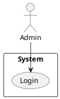

# 📊 PlantUML Use Case Diagrams - Chia Nhỏ Theo Module

Tôi đã chia diagram lớn thành **7 diagrams nhỏ**, mỗi diagram tập trung vào 1-2 modules. **Layout dọc, kích thước vừa phải!**

---

## 📁 Danh Sách Diagrams

### 1. **use-case-overview.puml** - Tổng Quan (NHÌN ĐẦU TIÊN)
**Nội dung:**
- High-level view của toàn bộ system
- 10 modules chính
- 2 actors (Admin, Tenant)
- Không chi tiết use cases

**Dùng cho:** Giới thiệu tổng quan system trong báo cáo

---

### 2. **use-case-auth.puml** - Authentication Module
**Nội dung:**
- 7 use cases: Login, Register, Reset Password, Refresh Token, Logout, Get Profile
- 2 actors: Admin, Tenant
- 1 external: Email Service
- Include relationships: Validate, Generate JWT, Hash Password

**Kích thước:** Nhỏ, vừa 1 trang A4

---

### 3. **use-case-building-room.puml** - Building & Room Management
**Nội dung:**
- **Building:** 5 use cases (Create, View, Update, Delete, Stats)
- **Room:** 8 use cases (CRUD + Bulk Update + Stats)
- 1 actor: Admin
- Include relationships: Validate, Calculate Stats

**Kích thước:** Vừa phải, layout dọc

---

### 4. **use-case-contract.puml** - Contract Management
**Nội dung:**
- 8 use cases: Create, View, Update, Terminate, **Move Room**, Delete, Stats
- 1 actor: Admin
- Include relationships cho **Move Room** (complex):
  - Calculate Pro-rata Rent
  - Calculate Utility Settlement
  - Calculate Deposit Adjustment
  - Create Settlement Invoice
  - Update Room Status

**Kích thước:** Vừa phải
**Highlight:** Move Room use case (phức tạp nhất)

---

### 5. **use-case-invoice-simple.puml** - Invoice Management
**Nội dung:**
- 14 use cases chia thành 5 packages:
  - Invoice Creation (4 use cases)
  - Invoice Publishing (2 use cases)
  - Payment Processing (2 use cases)
  - Invoice Viewing (4 use cases)
  - Invoice Operations (2 use cases)
- 2 actors: Admin, Tenant
- Include relationships:
  - Preview → Calculate Room/Service/Debt
  - Publish → Mark Readings as Billed
  - Payment → Create Transaction

**Kích thước:** Lớn nhưng chia package nên dễ nhìn

---

### 6. **use-case-reading.puml** - Meter Reading
**Nội dung:**
- 9 use cases chia thành 3 packages:
  - Reading Preparation (2 use cases)
  - Reading Creation (2 use cases)
  - Reading Management (5 use cases)
- 1 actor: Admin
- Include relationships:
  - Prepare → Get Previous Month Index
  - Create → Calculate Usage & Cost
  - Update/Delete → Validate Not Billed

**Kích thước:** Vừa phải

---

### 7. **use-case-others.puml** - Tenant, Service, Transaction, Issue
**Nội dung:**
- **Tenant Management:** 6 use cases
- **Service Management:** 5 use cases
- **Transaction Management:** 4 use cases
- **Issue Management:** 5 use cases
- 1 actor: Admin
- 1 external: Cloudinary

**Kích thước:** Vừa phải, 4 packages nhỏ

---

## 🚀 Cách Render (Từng Diagram)

### Cách 1: PlantUML Online (Khuyên Dùng)
1. Truy cập: **https://www.plantuml.com/plantuml/uml/**
2. Mở 1 file (VD: `use-case-overview.puml`)
3. Copy toàn bộ nội dung
4. Paste vào website
5. Click **Submit**
6. Download PNG/SVG

**Lặp lại cho 7 diagrams!**

---

### Cách 2: Render Tất Cả Cùng Lúc (VS Code)
1. Install extension: **PlantUML** (by jebbs)
2. Install **Graphviz**:
   ```bash
   # Windows
   choco install graphviz

   # macOS
   brew install graphviz

   # Linux
   sudo apt install graphviz
   ```
3. Mở thư mục `backend/`
4. Chuột phải vào file `.puml` → **Preview Current Diagram**
5. **Export All:** Chuột phải → **Export Workspace Diagrams**

---

### Cách 3: Batch Export (PlantUML CLI)
```bash
# Install PlantUML jar
brew install plantuml  # macOS
# hoặc download từ https://plantuml.com/download

# Export tất cả diagrams thành PNG
plantuml backend/*.puml

# Export thành SVG
plantuml -tsvg backend/*.puml
```

---

## 📋 Khuyến Nghị Sử Dụng Cho Báo Cáo

### Diagram 1: Overview (Trang đầu)
→ Dùng **use-case-overview.puml**
→ Giới thiệu tổng quan system

### Diagram 2-7: Chi Tiết Từng Module
→ Chọn 3-4 diagrams quan trọng nhất:
1. **use-case-auth.puml** (Authentication - quan trọng)
2. **use-case-contract.puml** (Complex với Move Room)
3. **use-case-invoice-simple.puml** (Phức tạp nhất)
4. **use-case-reading.puml** (Business logic)

### Không Dùng Hết 7 Diagrams
→ Quá nhiều, giảng viên chán
→ Chọn 4-5 diagrams đại diện

---

## 🎯 Điểm Khác Biệt So Với File Cũ

| Tiêu chí | File Cũ | Files Mới |
|----------|---------|-----------|
| **Layout** | Ngang dài | Dọc, vừa phải |
| **Số diagrams** | 2 (quá nhiều use cases) | 7 (chia nhỏ) |
| **Kích thước** | Quá lớn | Vừa 1 trang A4 |
| **Tổ chức** | Tất cả trong 1 | Chia theo module |
| **Dễ đọc** | ❌ Khó | ✅ Dễ |

---

## 📊 Thống Kê

**Tổng số diagrams:** 7 diagrams
**Tổng số use cases:** 70+ use cases
**Tổng số actors:** 2 (Admin, Tenant)
**External systems:** 2 (Email, Cloudinary)

**Phân bổ:**
- Overview: 1 diagram (high-level)
- Auth: 1 diagram (7 use cases)
- Building & Room: 1 diagram (13 use cases)
- Contract: 1 diagram (8 use cases)
- Invoice: 1 diagram (14 use cases)
- Reading: 1 diagram (9 use cases)
- Others: 1 diagram (20 use cases)

---

## 💡 Tips Render Đẹp

### 1. Export High Quality
```plantuml
' Thêm vào đầu file
skinparam dpi 300
```

### 2. Custom Colors (Optional)
```plantuml
skinparam actorBackgroundColor #FFE6E6
skinparam usecaseBackgroundColor #E6F3FF
skinparam packageBackgroundColor #F5F5F5
```

### 3. Adjust Font Size
```plantuml
skinparam defaultFontSize 12
skinparam actorFontSize 14
```

---

## ✅ Checklist Cho Báo Cáo

- [ ] Render **use-case-overview.puml** → Trang tổng quan
- [ ] Render **use-case-auth.puml** → Section Authentication
- [ ] Render **use-case-contract.puml** → Section Contract (highlight Move Room)
- [ ] Render **use-case-invoice-simple.puml** → Section Invoice (complex)
- [ ] Export PNG/SVG chất lượng cao
- [ ] Insert vào báo cáo Word/PowerPoint
- [ ] Add captions/notes giải thích

---

## 🔗 Quick Links

- **PlantUML Online:** https://www.plantuml.com/plantuml/uml/
- **PlantText:** https://www.planttext.com/
- **PlantUML Docs:** https://plantuml.com/use-case-diagram

---

## 📞 Test Ngay

**Copy code này vào PlantUML online:**


Nếu render thành công → Bạn đã sẵn sàng render 7 diagrams! 🎉

---

**Tất cả diagrams đã tối ưu cho kích thước A4, layout dọc, dễ đọc!** ✅
