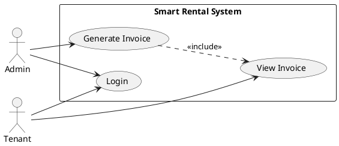

# 📊 Hướng Dẫn Vẽ Use Case Diagram UML Chuẩn

Tôi đã tạo cho bạn **PlantUML files** để vẽ Use Case Diagram **ĐÚNG CHUẨN UML** như hình mẫu bạn gửi!

---

## 📁 Files Đã Tạo

1. **use-case.puml** - Tổng quan toàn bộ system (54+ use cases)
2. **use-case-invoice.puml** - Chi tiết Invoice Module (phức tạp nhất)

---

## 🎨 Cách 1: Render Online (NHANH NHẤT - 0 phút setup)

### PlantUML Online Server
1. Truy cập: **https://www.plantuml.com/plantuml/uml/**
2. Copy toàn bộ nội dung file `use-case.puml`
3. Paste vào text area
4. Click **Submit**
5. Diagram tự động render đẹp!
6. Download:
   - **PNG** (cho Word/PowerPoint)
   - **SVG** (vector, không vỡ khi zoom)
   - **PDF** (cho báo cáo)

**Hoặc dùng PlantText:**
- Link: **https://www.planttext.com/**
- Giao diện đẹp hơn, live preview

---

## 🎨 Cách 2: VS Code (Khuyên Dùng - Cho Dev)

### Cài Extension
1. Mở VS Code
2. Install extension: **PlantUML** (by jebbs)
3. Cài thêm: **Graphviz** (required)
   ```bash
   # Windows (dùng Chocolatey)
   choco install graphviz

   # macOS
   brew install graphviz

   # Linux
   sudo apt-get install graphviz
   ```

### Render Diagram
1. Mở file `use-case.puml` trong VS Code
2. Nhấn **Alt+D** (Windows/Linux) hoặc **Option+D** (Mac)
3. Preview hiện bên cạnh
4. **Chuột phải → Export** để save PNG/SVG

### Live Preview
- Nhấn **Ctrl+Shift+P** → "PlantUML: Preview Current Diagram"
- Diagram tự động update khi bạn sửa code

---

## 🎨 Cách 3: IntelliJ/WebStorm (Cho Developers)

### Built-in Support
1. IntelliJ/WebStorm đã có PlantUML plugin sẵn
2. Mở file `.puml`
3. Click icon **Show Diagram** (bên phải)
4. Diagram render ngay trong IDE

---

## 🎨 Cách 4: GitHub Pages (Tự Động Render)

### Dùng PlantUML Proxy
GitHub không render PlantUML trực tiếp, nhưng có thể dùng proxy:

```markdown

```

Hoặc convert PlantUML → SVG rồi commit SVG file.

---

## 🎨 Cách 5: Draw.io (Vẽ Tay - Đẹp Nhất)

Nếu bạn muốn **tự vẽ** để layout đẹp hơn:

### Trên Draw.io (app.diagrams.net)
1. Truy cập: **https://app.diagrams.net/**
2. **File → New → Blank Diagram**
3. Dùng shapes từ sidebar:
   - **UML → Use Case** (ovals)
   - **UML → Actor** (stick figures)
   - **UML → System Boundary** (rectangles)
4. Kéo thả và arrange theo ý thích
5. Export PNG/SVG chất lượng cao

### Tips Vẽ Đẹp:
- Actor ở 2 bên (Admin bên trái, External services bên phải)
- Use cases trong system boundary
- Dùng colors để phân biệt modules
- Arrows: `-->` (association), `..>` (include/extend)

---

## 📋 PlantUML Syntax Cơ Bản

### Actors
```plantuml
actor "Admin" as Admin
actor "Email Service" as Email <<service>>
```

### Use Cases
```plantuml
usecase "Login" as UC1
usecase "Generate Invoice" as UC2
```

### System Boundary
```plantuml
rectangle "System Name" {
  usecase "Use Case 1" as UC1
  usecase "Use Case 2" as UC2
}
```

### Relationships
```plantuml
Admin --> UC1                    ' Association
UC2 ..> UC3 : <<include>>       ' Include
UC4 .> UC5 : <<extend>>         ' Extend
```

### Packages (Modules)
```plantuml
package "Invoice Management" {
  usecase "Generate Invoice" as Gen
  usecase "Preview Invoice" as Preview
}
```

### Layout Direction
```plantuml
left to right direction         ' Horizontal layout
' OR
top to bottom direction         ' Vertical layout (default)
```

### Notes
```plantuml
note right of UC1
  This is a note
  explaining the use case
end note
```

---

## 🎯 Files Đã Tạo Chi Tiết

### 1. use-case.puml (Main Diagram)
**Actors:**
- Admin (54 use cases)
- Tenant (2 use cases)
- Email Service (external)
- Cloudinary (external)

**Modules:**
- Authentication (5 use cases)
- Building Management (4 use cases)
- Room Management (6 use cases)
- Tenant Management (5 use cases)
- Contract Management (7 use cases)
- Service Management (3 use cases)
- Meter Reading (4 use cases)
- Invoice Management (10 use cases)
- Transaction Management (2 use cases)
- Issue Management (3 use cases)

**Relationships:**
- `<<include>>`: Create Contract includes Update Room Status
- `<<uses>>`: Reset Password uses Email Service

### 2. use-case-invoice.puml (Detailed Invoice Module)
**Layout:** Left to right direction (như mẫu bạn gửi)

**Actors:**
- Admin (full access)
- Tenant (view public only)
- Database (system)

**Use Cases:**
- 12 main use cases
- 8 internal use cases

**Relationships:**
- Preview Invoice `<<include>>` Calculate Room Charge
- Preview Invoice `<<include>>` Calculate Service Charge
- Generate Invoice `<<include>>` Preview Invoice
- Publish Invoice `<<include>>` Mark Readings as Billed

**Notes:**
- Preview: "Calculate invoice without saving"
- Payment: "Multi-payment support"
- View Public: "No authentication required"

---

## 💡 Tips Cho Báo Cáo Capstone

### 1. Export Chất Lượng Cao
- **PNG**: 300 DPI minimum
- **SVG**: Vector, không bị vỡ khi phóng to
- Từ PlantUML online, chọn **SVG** → Import vào Word

### 2. Layout Đẹp
- Dùng `left to right direction` cho diagram ngang
- Package modules thành groups
- Màu sắc để phân biệt (PlantUML có thể custom colors)

### 3. Multiple Diagrams
- **Overview diagram**: Toàn bộ system (use-case.puml)
- **Detailed diagrams**: Từng module (use-case-invoice.puml)
- Giảng viên thích detailed diagrams hơn!

### 4. Custom Colors (Optional)
```plantuml
skinparam actorBackgroundColor #FFE6E6
skinparam usecaseBackgroundColor #E6F3FF
skinparam packageBackgroundColor #F0F0F0
```

---

## 🔧 Troubleshooting

### PlantUML không render?
- Check syntax: paste vào plantuml.com/plantuml
- Ensure Graphviz installed (for VS Code)
- Try online server first

### Diagram quá lớn/nhỏ?
```plantuml
scale 1.5                ' Phóng to 150%
scale 0.8                ' Thu nhỏ 80%
```

### Layout bị lộn xộn?
```plantuml
left to right direction  ' Chuyển sang ngang
' Hoặc manual arrange trong Draw.io
```

### Muốn style khác?
- Tham khảo: https://plantuml.com/use-case-diagram
- Hoặc dùng Draw.io để vẽ tay

---

## 📊 So Sánh Tools

| Tool | Render Speed | Quality | Edit | Best For |
|------|-------------|---------|------|----------|
| **PlantUML Online** | ⚡ Instant | ⭐⭐⭐⭐ | ❌ Code only | Quick export |
| **VS Code** | ⚡ Fast | ⭐⭐⭐⭐⭐ | ✅ Live preview | Development |
| **Draw.io** | 🖱️ Manual | ⭐⭐⭐⭐⭐ | ✅✅ Visual | Custom layout |
| **IntelliJ** | ⚡ Fast | ⭐⭐⭐⭐ | ✅ Built-in | Pro developers |

---

## 🎓 Recommended Workflow

### Cho Báo Cáo
1. **Tạo diagram**: PlantUML (code-based, versioned)
2. **Export**: SVG từ plantuml.com
3. **Insert**: Vào Word/PowerPoint
4. **Adjust**: Trong Draw.io nếu cần layout đẹp hơn

### Cho Documentation
1. Commit `.puml` files vào Git
2. Render sang SVG và commit SVG
3. Link SVG trong README.md

### Cho Presentation
1. Export PNG (300 DPI)
2. Hoặc vẽ lại trong Draw.io với colors đẹp
3. Export từ Draw.io → PNG transparent background

---

## 🚀 Next Steps

1. ✅ Đã tạo: `use-case.puml` + `use-case-invoice.puml`
2. 📝 **Bạn có thể:**
   - Render online tại plantuml.com
   - Install VS Code extension để edit live
   - Vẽ lại trong Draw.io nếu muốn custom layout
   - Export PNG/SVG cho báo cáo

3. 🎯 **Để có diagram đẹp như mẫu:**
   - Dùng PlantUML với `left to right direction`
   - Hoặc import vào Draw.io và arrange manual
   - Add colors với skinparam

---

## 🔗 Useful Links

- **PlantUML Online**: https://www.plantuml.com/plantuml/uml/
- **PlantText** (prettier UI): https://www.planttext.com/
- **PlantUML Docs**: https://plantuml.com/use-case-diagram
- **Draw.io**: https://app.diagrams.net/
- **VS Code Extension**: Search "PlantUML" by jebbs

---

## 📞 Example: Render Right Now

### Quick Test
1. Copy code này:


2. Paste vào: https://www.plantuml.com/plantuml/uml/
3. Click Submit
4. Boom! 🎉 Use Case Diagram đẹp như mẫu!

---

**Files sẵn sàng để render!** 🎨
