# Use Case Diagram - Smart Rental Backend System

## Main Use Case Diagram

## Authentication Module - Use Cases

```mermaid
graph LR
    Admin[👤 Admin]
    Tenant[👤 Tenant]

    subgraph "Authentication"
        Login[Login]
        Register[Register]
        ResetPwd[Reset Password]
        Refresh[Refresh Token]
        Logout[Logout]
        GetProfile[Get Profile]
    end

    Admin --> Login
    Admin --> Register
    Admin --> ResetPwd
    Admin --> Refresh
    Admin --> Logout
    Admin --> GetProfile

    Tenant --> Login
    Tenant --> Register
    Tenant --> ResetPwd
    Tenant --> Refresh
    Tenant --> Logout
    Tenant --> GetProfile

    style Admin fill:#ff9999
    style Tenant fill:#99ccff
    style Login fill:#ffe6e6
    style Register fill:#ffe6e6
    style ResetPwd fill:#ffe6e6
    style Refresh fill:#ffe6e6
    style Logout fill:#ffe6e6
    style GetProfile fill:#ffe6e6
```

## Building & Room Management - Use Cases

## Contract Management - Use Cases

```mermaid
graph TB
    Admin[👤 Admin]

    subgraph "Contract Lifecycle"
        direction TB
        C1[Create Contract]
        C2[View Contracts]
        C3[View Contract Detail]
        C4[Update Contract]
        C5[Terminate Contract]
        C6[Move Room]
        C7[View Contract Stats]
    end

    subgraph "Related Actions"
        direction TB
        A1[Update Room Status to RENTED]
        A2[Create Initial Meter Readings]
        A3[Calculate Pro-rata Rent]
        A4[Generate Settlement Invoice]
        A5[Create Deposit Transaction]
    end

    Admin --> C1
    Admin --> C2
    Admin --> C3
    Admin --> C4
    Admin --> C5
    Admin --> C6
    Admin --> C7

    C1 -.includes.-> A1
    C1 -.includes.-> A2
    C6 -.includes.-> A3
    C6 -.includes.-> A4
    C6 -.includes.-> A5

    style Admin fill:#ff9999
    style C6 fill:#ffcccc
```

## Invoice Management - Use Cases (Most Complex)

```mermaid
graph TB
    Admin[👤 Admin]
    Tenant[👤 Tenant]

    subgraph "Invoice Creation"
        direction TB
        I1[Preview Invoice]
        I2[Generate Draft Invoice]
        I3[Bulk Generate Invoices]
        I4[Update Draft Invoice]
    end

    subgraph "Invoice Publishing"
        direction TB
        I5[Publish Invoice]
        I6[Unpublish Invoice]
    end

    subgraph "Payment Processing"
        direction TB
        I7[Record Payment]
        I8[View Payment History]
    end

    subgraph "Invoice Operations"
        direction TB
        I9[View All Invoices]
        I10[View Invoice Detail]
        I11[View Invoice by Month]
        I12[View Invoice Stats]
        I13[Cancel Invoice]
        I14[Delete Invoice]
    end

    subgraph "Tenant Access"
        direction TB
        I15[View Invoice Public]
    end

    Admin --> I1
    Admin --> I2
    Admin --> I3
    Admin --> I4
    Admin --> I5
    Admin --> I6
    Admin --> I7
    Admin --> I8
    Admin --> I9
    Admin --> I10
    Admin --> I11
    Admin --> I12
    Admin --> I13
    Admin --> I14

    Tenant --> I15

    I1 -.extends.-> I2
    I2 -.includes.-> I4
    I5 -.includes.-> I8
    I7 -.includes.-> I8

    style Admin fill:#ff9999
    style Tenant fill:#99ccff
    style I1 fill:#fff2cc
    style I2 fill:#fff2cc
    style I7 fill:#ccffcc
```

## Meter Reading - Use Cases

```mermaid
graph TB
    Admin[👤 Admin]

    subgraph "Reading Preparation"
        direction TB
        R1[Prepare Single Reading]
        R2[Prepare Bulk Reading]
    end

    subgraph "Reading Creation"
        direction TB
        R3[Create Single Reading]
        R4[Create Bulk Reading]
    end

    subgraph "Reading Management"
        direction TB
        R5[View Readings List]
        R6[View Unread Rooms]
        R7[Update Reading]
        R8[Delete Reading]
        R9[View Reading Stats]
    end

    Admin --> R1
    Admin --> R2
    Admin --> R3
    Admin --> R4
    Admin --> R5
    Admin --> R6
    Admin --> R7
    Admin --> R8
    Admin --> R9

    R1 -.includes.-> R3
    R2 -.includes.-> R4

    style Admin fill:#ff9999
    style R4 fill:#ffcccc
```

## System Interactions

```mermaid
graph LR
    subgraph "External Systems"
        Email[📧 Email Service<br/>Nodemailer]
        Cloud[☁️ Cloudinary<br/>Image Storage]
    end

    subgraph "Backend System"
        Auth[Auth Module]
        Upload[Upload Module]
        Mail[Mail Module]
    end

    Auth -.sends email.-> Mail
    Mail --> Email
    Upload --> Cloud

    style Email fill:#e1f5ff
    style Cloud fill:#e1f5ff
```

## Complex Use Case: Move Room (Extended)

## Actor Permissions Summary

```mermaid
graph TB
    subgraph "Admin Permissions"
        direction LR
        A1[Full CRUD on all modules]
        A2[Generate Invoices]
        A3[Record Payments]
        A4[Manage Contracts]
        A5[Move Rooms]
        A6[Bulk Operations]
    end

    subgraph "Tenant Permissions"
        direction LR
        T1[Login/Register]
        T2[View Own Invoices]
        T3[Reset Password]
    end

    Admin[👤 Admin] --> A1
    Admin --> A2
    Admin --> A3
    Admin --> A4
    Admin --> A5
    Admin --> A6

    Tenant[👤 Tenant] --> T1
    Tenant --> T2
    Tenant --> T3

    style Admin fill:#ff9999
    style Tenant fill:#99ccff
```

## Use Case Statistics

**Total Use Cases:** 54+ use cases

**By Module:**
- Authentication: 6 use cases
- Buildings: 5 use cases
- Rooms: 10 use cases
- Tenants: 5 use cases
- Contracts: 8 use cases (including complex Move Room)
- Services: 6 use cases
- Readings: 9 use cases
- Invoices: 14 use cases (most complex)
- Transactions: 4 use cases
- Issues: 6 use cases
- Upload: 3 use cases
- Mail: 2 use cases

**Complexity:**
- Simple: 30%
- Medium: 40%
- Complex: 30%

**Actors:**
- Admin: Full access (54 use cases)
- Tenant: Limited access (3 use cases)

---

## How to View

1. **GitHub:** Push file lên và GitHub tự động render
2. **VS Code:** Install "Markdown Preview Mermaid Support"
3. **Online:** Copy code vào https://mermaid.live/
