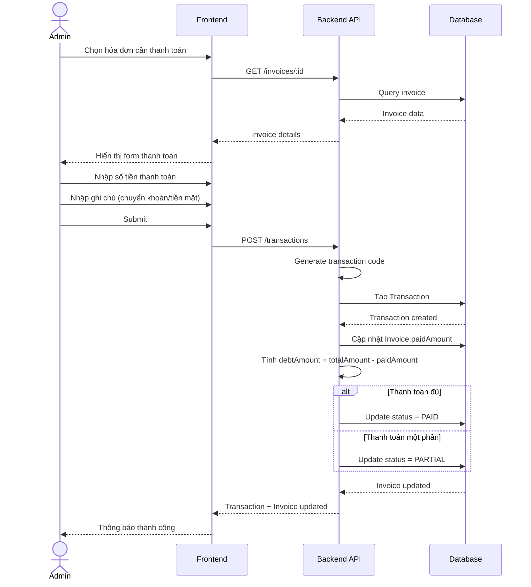

# Sequence Diagrams - Smart Rental Management

> Copy code mermaid bên dưới vào https://mermaid.live để xem diagram

## 1. Đăng nhập hệ thống

## 2. Tạo hợp đồng mới

## 3. Ghi chỉ số điện nước

## 4. Tạo hóa đơn hàng tháng

## 5. Gửi hóa đơn cho khách

## 6. Thanh toán hóa đơn

## 7. Báo sự cố

## 8. Kết thúc hợp đồng

## 9. Flow tổng quan hàng tháng

