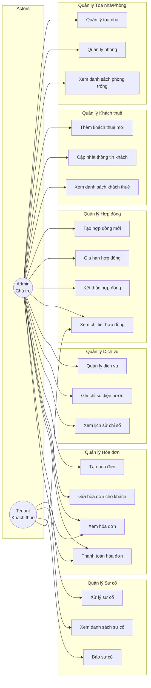
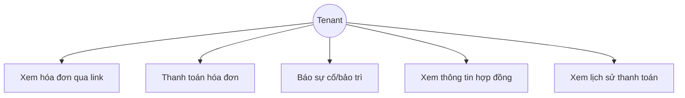

# Use Case Diagram - Smart Rental Management

> Copy code mermaid bên dưới vào https://mermaid.live để xem diagram

## Tổng quan hệ thống

## Chi tiết Use Cases theo Actor

### Admin (Chủ trọ)

```mermaid
flowchart TB
    Admin((Admin))

    Admin --> A1[Đăng nhập/Đăng xuất]
    Admin --> A2[Quản lý tòa nhà]
    Admin --> A3[Quản lý phòng]
    Admin --> A4[Quản lý khách thuê]
    Admin --> A5[Quản lý hợp đồng]
    Admin --> A6[Quản lý dịch vụ]
    Admin --> A7[Ghi chỉ số điện nước]
    Admin --> A8[Tạo & gửi hóa đơn]
    Admin --> A9[Ghi nhận thanh toán]
    Admin --> A10[Xử lý sự cố]
    Admin --> A11[Xem báo cáo thống kê]

    A2 --> A2a[Thêm tòa nhà]
    A2 --> A2b[Sửa tòa nhà]
    A2 --> A2c[Xóa tòa nhà]

    A3 --> A3a[Thêm phòng]
    A3 --> A3b[Sửa thông tin phòng]
    A3 --> A3c[Xóa phòng]
    A3 --> A3d[Cập nhật trạng thái]

    A5 --> A5a[Tạo hợp đồng]
    A5 --> A5b[Gia hạn hợp đồng]
    A5 --> A5c[Kết thúc hợp đồng]

    A8 --> A8a[Tạo hóa đơn tự động]
    A8 --> A8b[Chỉnh sửa hóa đơn]
    A8 --> A8c[Gửi hóa đơn qua link]
```

### Tenant (Khách thuê)

